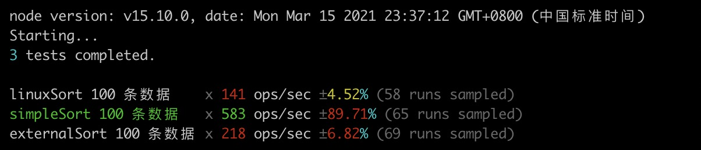

# external-sort
external sorting

[![NPM version][npm-image]][npm-url]
[![build status][travis-image]][travis-url]
[![Test coverage][codecov-image]][codecov-url]
[![David deps][david-image]][david-url]
[![Known Vulnerabilities][snyk-image]][snyk-url]
[![npm download][download-image]][download-url]

[npm-image]: https://img.shields.io/npm/v/external-sort.svg?style=flat-square
[npm-url]: https://npmjs.org/package/external-sort
[travis-image]: https://img.shields.io/travis/gxcsoccer/external-sort.svg?style=flat-square
[travis-url]: https://travis-ci.org/gxcsoccer/external-sort
[codecov-image]: https://codecov.io/gh/gxcsoccer/external-sort/branch/main/graph/badge.svg
[codecov-url]: https://codecov.io/gh/gxcsoccer/external-sort
[david-image]: https://img.shields.io/david/gxcsoccer/external-sort.svg?style=flat-square
[david-url]: https://david-dm.org/gxcsoccer/external-sort
[snyk-image]: https://snyk.io/test/npm/external-sort/badge.svg?style=flat-square
[snyk-url]: https://snyk.io/test/npm/external-sort
[download-image]: https://img.shields.io/npm/dm/external-sort.svg?style=flat-square
[download-url]: https://npmjs.org/package/external-sort


## 用法

```js
const input = fs.createReadStream(inputFile); // 输入文件流
const output = fs.createWriteStream(outputFile); // 输出文件流

await externalSort(input, output, {
  maxHeap: 1024 * 1024,
});
```

## 支持的参数

- `maxHeap` 内存排序的上限，超过需要借助文件，默认值为 1GB
- `tempDir` 临时文件目录，默认为 `os.tmpdir()`
- `serializer` 回写文件时处理数据的函数
- `deserializer` 处理一行输入的函数
- `comparer` 排序的比较函数

## Benchmark


